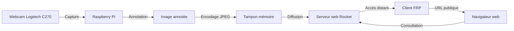

# Webcam OpenCV Rust

Un système de webcam connecté utilisant Rust, OpenCV et Rocket pour la capture, l'annotation et la diffusion d'images en temps réel.

## Description

Ce projet implémente un système de webcam connecté qui capture des images à partir d'une webcam Logitech C270, les annote avec des informations de lieu et de date, puis les diffuse via un serveur web Rocket. Les images annotées peuvent être consultées à distance grâce à l'utilisation de FRP (Fast Reverse Proxy) de Fatedier.

## Prérequis

- Rust et Cargo installés sur votre système
- OpenCV installé sur votre système
- Une webcam Logitech C270 connectée à votre Raspberry Pi
- Un serveur FRP configuré pour l'accès à distance

## Installation

1. Clonez ce repository sur votre Raspberry Pi : git clone https://github.com/LukaChassaing/webcam-opencv-rust
2. Accédez au répertoire du projet : cd webcam-opencv-rust
3. Compilez le projet avec Cargo : cargo build --release
4. Configurez le client FRP sur votre Raspberry Pi en suivant la documentation officielle de FRP.

## Utilisation

1. Lancez le serveur de webcam avec la commande suivante : ./target/release/webcam_server
2. Accédez à l'image annotée de la webcam via l'URL fournie par FRP.

## Fonctionnement

Voici un schéma Mermaid illustrant le fonctionnement du système de webcam connecté :

1. La webcam Logitech C270 capture des images en continu.
2. Le Raspberry Pi reçoit les images capturées.
3. Les images sont annotées avec des informations de lieu et de date à l'aide d'OpenCV.
4. Les images annotées sont encodées au format JPEG et stockées dans un tampon mémoire.
5. Le serveur web Rocket diffuse les images annotées lorsqu'une requête est reçue.
6. Le client FRP fournit un accès distant sécurisé au serveur web Rocket.
7. Les images annotées peuvent être consultées via un navigateur web en utilisant l'URL publique fournie par FRP.

## Contribution
Les contributions à ce projet sont les bienvenues. Si vous souhaitez apporter des améliorations ou corriger des bugs, veuillez soumettre une demande de fusion (pull request).

## Licence
Ce projet est sous licence MIT. Voir le fichier LICENSE pour plus de détails.
